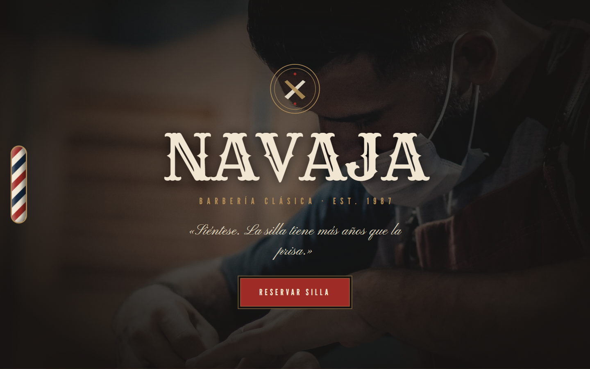
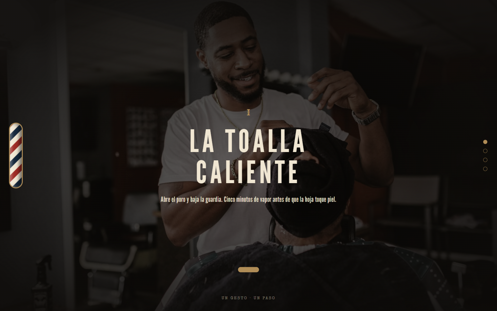

# NAVAJA — Barbería clásica · EST. 1987 · Guadalajara

**Ver en vivo → [https://b0b1a6ae23.github.io/navaja-barberia/](https://b0b1a6ae23.github.io/navaja-barberia/)**


Landing de barbería clásica con dirección de arte **investigada para el giro**
(paletas de barberías reales → espresso/navy/crema/oxblood/latón) y navegación
por secciones tipo *takeover*.

| Hero | Sección |
| --- | --- |
|  |  |

## Técnicas

- **GSAP Observer** para el takeover de secciones completas (candado `animating`,
  liberación del scroll nativo al rebasar los extremos; gotcha documentado:
  `scrollTo` ANTES de `overflow: hidden` o el scroll se congela a mitad).
- **MorphSVGPlugin** (`type: "rotational"`) morfando iconos de oficio: navaja →
  tijera → brocha.
- **Image trail** con rAF siguiendo el cursor en la galería.
- **Barber pole CSS puro**: `background-position` animado exactamente un periodo
  (79.2 px) para el loop perfecto.
- Tipografía "Tonsorial Parlor": Rye + League Gothic + Pinyon Script + Special Elite.
- La historia real del poste de barbero como sección narrativa.

## Cómo correr

```bash
npx http-server . -p 8080
```

## Licencia

Código bajo licencia [MIT](LICENSE). **NAVAJA** es una marca ficticia creada para demostrar trabajo de portafolio; cualquier parecido con un negocio real es coincidencia. Los recursos de terceros (fotografías, videos y modelos 3D) conservan la licencia original de sus autores — ver Créditos.

## Créditos

Fotografía: [Pexels](https://www.pexels.com).

---
**Ángel Josué García Cantero** · Serie *páginas-película*.